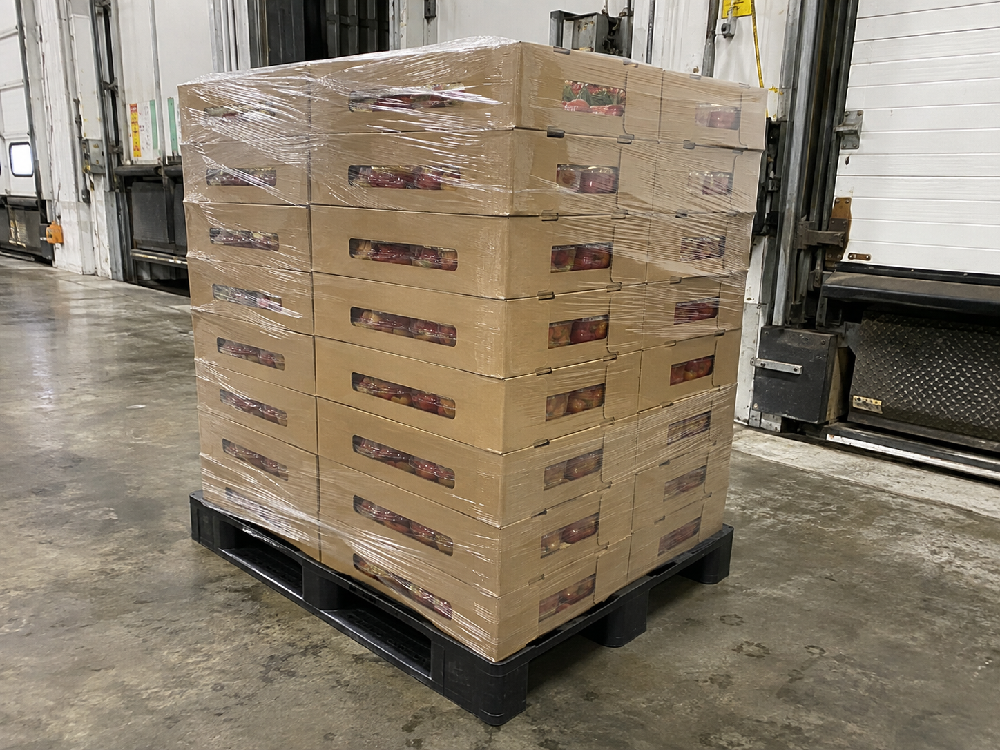
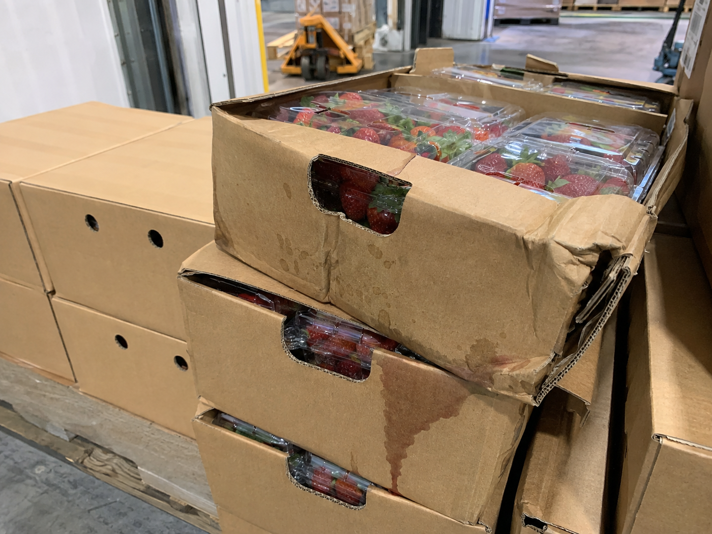

# ProofPay Live Demo Flow

For word-for-word narration and screen cues, use the [presentation script](DEMO_PRESENTATION_SCRIPT.md).

## Demo objective

Show a complete buyer-to-supplier transaction using a live **30 USDC** order:

1. The buyer creates a purchase order.
2. The supplier reviews and accepts it.
3. The buyer secures 30 USDC in escrow.
4. The supplier records dispatch with evidence.
5. The buyer records delivery and identifies partial damage.
6. Only the disputed 3.60 USDC remains under review.
7. Both parties submit evidence.
8. AI analyses the evidence and proposes a settlement.
9. Both parties approve and execute the settlement.

The buyer starts with 40 USDC, so this scenario leaves a 10 USDC safety buffer. New orders use USDC and gas is sponsored.

## Demo story

Choong Trading Sdn. Bhd. purchases fresh produce from FreshSource Foods Sdn. Bhd. The supplier photographs an intact pallet before collection. At delivery, three strawberry cartons are found crushed and wet. The buyer accepts every unaffected item and raises a claim only for the damaged cartons.

All companies, records, documents, and photographs in this flow are synthetic demonstration data.

## Accounts and browser setup

Use two browser profiles so both parties can remain signed in.

| Browser | Role | Account |
|---|---|---|
| Main Chrome profile | Buyer | CHOONG ZHUO LIN Google account, company name set to Choong Trading Sdn. Bhd. |
| Incognito or second Chrome profile | Supplier | `payproof94@gmail.com`, if this is a Google account you control |

The supplier must sign in with exactly the email entered when the order is created. An invitation URL is intentionally bound to that recipient.

Because email delivery may be unreliable, use the generated confirmation link during the presentation:

1. Create the order.
2. Click **Copy link**.
3. Paste the link into the supplier browser.
4. Sign in using the invited supplier email.

This still creates and processes a normal live order. It only bypasses email delivery.

## Files to prepare

Keep all demo files in one folder before presenting.

### Evidence images

#### Supplier dispatch evidence

Use this when the supplier records dispatch and again if the supplier responds to the claim.

[Open supplier dispatch photo](demo-upload-files/supplier-dispatch.png)

Public copy: [supplier-dispatch.png](https://backend-rouge-eight-58.vercel.app/demo-evidence/supplier-dispatch.png)



#### Buyer receiving evidence

Use this during the buyer's inspection and claim.

[Open buyer damage photo](demo-upload-files/receiving-damage.png)

Public copy: [receiving-damage.png](https://backend-rouge-eight-58.vercel.app/demo-evidence/receiving-damage.png)



### Purchase order file

Use the ready-made [`PP-DEMO-0905-purchase-order.pdf`](demo-upload-files/PP-DEMO-0905-purchase-order.pdf). A plain-text fallback named [`PP-DEMO-0905-purchase-order.txt`](demo-upload-files/PP-DEMO-0905-purchase-order.txt) is also included.

```text
PURCHASE ORDER

Reference: PP-DEMO-0905
Issue date: 05 September 2026
Expected delivery: 12 September 2026

Buyer:
Choong Trading Sdn. Bhd.

Supplier:
FreshSource Foods Sdn. Bhd.
Contact: payproof94@gmail.com

Delivery location:
Receiving Bay 2
Shah Alam Distribution Centre

LINE ITEMS

1. Fresh strawberries, 8 x 250 g punnets
   Quantity: 10 cartons
   Unit price: 1.20 USDC
   Line total: 12.00 USDC

2. Fresh blueberries, 12 x 125 g punnets
   Quantity: 6 cartons
   Unit price: 1.50 USDC
   Line total: 9.00 USDC

3. Premium Hass avocados, 4 kg
   Quantity: 6 crates
   Unit price: 1.50 USDC
   Line total: 9.00 USDC

TOTAL ORDER VALUE: 30.00 USDC

Receiving terms:
Goods will be checked at Receiving Bay 2.
Visible exceptions will be photographed at handover.
Undisputed goods may be accepted and released separately from damaged goods.
```

Do not use the existing `demo-evidence/purchase-order.txt` for the live transaction. That file belongs to the 10,200 USDC guided sample order.

### Commercial agreement PDF

Use the ready-made [`PP-DEMO-0905-agreement.pdf`](demo-upload-files/PP-DEMO-0905-agreement.pdf). It contains this agreement:

```text
COLD-CHAIN DELIVERY AGREEMENT
Reference: PP-DEMO-0905

1. The supplier will photograph the pallet immediately before carrier collection.
2. The buyer will inspect the shipment and record visible exceptions at handover.
3. Damaged quantities will be valued using the purchase order unit price.
4. The undisputed portion may be released while a claim is reviewed.
5. If the parties disagree, both parties may submit evidence for AI-assisted mediation.
6. Any proposed settlement requires approval from both buyer and supplier.

This document contains synthetic data prepared for a ProofPay product demonstration.
```

### Delivery note PDF

Use the ready-made [`DO-FS-0905.pdf`](demo-upload-files/DO-FS-0905.pdf). It contains this delivery record:

```text
DELIVERY NOTE

Delivery order: DO-FS-0905
Purchase order: PP-DEMO-0905
Carrier: DHL Express
Tracking number: DHL-PP-0905-MY
Delivery location: Receiving Bay 2, Shah Alam Distribution Centre

Delivered:
10 cartons fresh strawberries
6 cartons fresh blueberries
6 crates premium Hass avocados

Receiving exception:
Three strawberry cartons were observed with crushed corners and moisture damage.
The blueberries and avocados were received in apparently sound condition.

This document contains synthetic data prepared for a ProofPay product demonstration.
```

## Exact purchase order values

Choose **I am buying** and enter:

| Field | Value |
|---|---|
| Supplier company | FreshSource Foods Sdn. Bhd. |
| Supplier contact email | `payproof94@gmail.com` |
| Purchase order reference | `PP-DEMO-0905` |
| Expected delivery | 12 September 2026 |
| Delivery location | Receiving Bay 2, Shah Alam Distribution Centre |

Enter or verify these imported lines:

| Product | Quantity | Unit | Unit price | Line total |
|---|---:|---|---:|---:|
| Fresh strawberries, 8 x 250 g punnets | 10 | cartons | 1.20 USDC | 12.00 USDC |
| Fresh blueberries, 12 x 125 g punnets | 6 | cartons | 1.50 USDC | 9.00 USDC |
| Premium Hass avocados, 4 kg | 6 | crates | 1.50 USDC | 9.00 USDC |
| **Order total** | | | | **30.00 USDC** |

The deployed PO importer currently supports PDF, PNG, JPEG, WebP, TXT, and CSV files up to 8 MB. Always review the extracted quantities and prices before creating the order.

## Full presentation flow

### 1. Introduce the problem

Open the public homepage and say:

> ProofPay protects a commercial order from agreement through settlement. I will create a live 30 USDC purchase and show what happens when only part of the delivery is damaged.

Sign in as the buyer. Briefly show:

- The account belongs to CHOONG ZHUO LIN and the workspace company name is `Choong Trading Sdn. Bhd.`.
- 40 USDC available in the wallet.
- The order will be created in USDC.
- Gas is sponsored.

### 2. Create the purchase order

1. Click **New purchase order**.
2. Choose **I am buying**.
3. Click **Import from file**.
4. Select `PP-DEMO-0905-purchase-order.pdf`.
5. Review every extracted field and line item.
6. Confirm the supplier email is the exact Google account used in the supplier browser.
7. Attach `PP-DEMO-0905-agreement.pdf`.
8. Accept the commercial agreement acknowledgement.
9. Click **Send for supplier confirmation**.
10. Click **Copy link**.

Say:

> Both businesses begin with the same order, quantities, prices, delivery terms, and supporting documents.

### 3. Supplier reviews and accepts

1. Move to the supplier browser.
2. Paste the copied confirmation link.
3. Sign in as the exact invited supplier email.
4. Review all three line items.
5. Select **I have reviewed every line**.
6. Select **I accept these terms on behalf of FreshSource Foods Sdn. Bhd.**
7. Click **Confirm and accept terms**.

Say:

> The supplier has accepted the exact commercial record that the buyer created.

### 4. Buyer secures the payment

1. Return to the buyer browser.
2. Refresh the order if necessary.
3. Click **Fund escrow**.
4. Review and approve the 30 USDC transaction.
5. Wait for the confirmed funded state before continuing.

Show that 30 USDC is secured and approximately 10 USDC remains available.

Say:

> The money is committed, but it is not automatically paid to the supplier. Release depends on the delivery outcome.

If the interface takes time to refresh, do not immediately fund again. First check whether the original transaction was confirmed.

### 5. Supplier records dispatch

1. Switch to the supplier browser.
2. Click **Ship the goods**.
3. Enter carrier `DHL Express`.
4. Enter tracking number `DHL-PP-0905-MY`.
5. Attach `supplier-dispatch.png`.
6. Click **Mark as shipped** and confirm.

Say:

> The supplier records evidence while the shipment is still under their control. This becomes the before-delivery record.

### 6. Buyer records arrival

1. Switch to the buyer browser.
2. Click **The goods have arrived**.
3. Enter delivery order number `DO-FS-0905`.
4. Attach `DO-FS-0905.pdf`.
5. Confirm the arrival.

Say:

> Arrival and acceptance are separate. Recording delivery does not automatically release the whole payment.

### 7. Buyer opens a partial claim

Choose **Some items missing or damaged**.

Record:

| Product | Accepted | Damaged |
|---|---:|---:|
| Strawberries | 7 cartons | 3 cartons |
| Blueberries | 6 cartons | 0 |
| Avocados | 6 crates | 0 |

Enter this inspection statement:

```text
Three strawberry cartons arrived with crushed corners and leaking punnets.
The exception was recorded before the pallet left Receiving Bay 2.
The blueberries and avocados were accepted in full.
We request 3.60 USDC back for the three unsaleable strawberry cartons.
```

Attach `receiving-damage.png`, then use the normal **Open claim for 3.60 USDC** action.

Show the audience:

- Total order value: 30.00 USDC
- Undisputed value: 26.40 USDC
- Disputed value: 3.60 USDC

Say:

> ProofPay does not freeze the entire order. Only the 3.60 USDC connected to the damaged cartons remains disputed.

### 8. Supplier responds with evidence

1. Switch to the supplier browser.
2. Choose **Dispute with evidence**.
3. Attach `supplier-dispatch.png`.
4. Enter the following response.

```text
Our dispatch photograph shows the strawberry cartons intact, dry, and
stretch-wrapped before carrier collection. We accept that damage was present
at delivery, but the condition appears consistent with handling during
carriage. We dispute full responsibility and propose sharing the 3.60 USDC loss.
```

5. Submit the response.

Say:

> The order now contains evidence from both sides, captured at different points in the delivery.

### 9. Request AI mediation

1. Click **Request AI mediation**.
2. Wait for the proposal to complete.
3. Show the proposed buyer refund and supplier release.
4. Open the **AI analysis** tab.
5. Show the evidence considered, reasoning, and any uncertainty identified.

Do not promise a particular split. Present the result that the mediator produces.

Say:

> The AI organises the evidence and recommends exact settlement numbers. It cannot move the money by itself. Both businesses still have to approve the outcome.

### 10. Both parties accept

1. Let the first party click **Accept proposal**.
2. Switch browsers.
3. Let the second party accept the same proposal.

Say:

> One company cannot impose a settlement. Both sides must accept the same numbers.

### 11. Sign and execute settlement

For each party:

1. Review the final allocation.
2. Sign the settlement.
3. Switch to the other account and sign the same settlement.
4. Once both signatures are recorded, execute the settlement.

Show the final status and transaction reference.

Say:

> Both parties signed the same allocation, and the settlement is now connected to the original order and its evidence.

### 12. End on the audit trail

Show:

- Original purchase order
- Commercial agreement
- Supplier acceptance
- Funding event
- Dispatch record and photograph
- Delivery record
- Buyer damage evidence
- Supplier response
- AI analysis
- Both approvals
- Final settlement event

Finish with:

> ProofPay turns a disputed delivery from a chain of emails and screenshots into one shared, auditable settlement process.

## Suggested timing

| Section | Target time |
|---|---:|
| Introduction and order creation | 2 minutes |
| Supplier acceptance and funding | 2 minutes |
| Dispatch and arrival | 1 minute |
| Inspection and claim | 2 minutes |
| Supplier response and AI analysis | 2 minutes |
| Settlement and audit trail | 2 minutes |
| **Total** | **11 minutes** |

## Pre-demo checklist

- [ ] The deployed application shows USDC throughout the new-order flow.
- [ ] The buyer wallet contains at least 40 USDC on the correct network.
- [ ] The buyer company name is set to `Choong Trading Sdn. Bhd.` from the account menu.
- [ ] Sponsored transactions are working.
- [ ] Buyer and supplier Google accounts are open in separate browser profiles.
- [ ] The supplier email exactly matches the invitation recipient.
- [ ] `PP-DEMO-0905-purchase-order.pdf` is ready.
- [ ] `PP-DEMO-0905-agreement.pdf` is ready.
- [ ] `DO-FS-0905.pdf` is ready.
- [ ] Both evidence images are downloaded and easy to find.
- [ ] The invitation link copy-and-paste route has been tested.
- [ ] The exposed Brevo API key has been rotated before being placed on Render.
- [ ] The guided sample is open in a separate tab as a visual fallback.

Guided sample fallback: [DEMO-1001](https://backend-rouge-eight-58.vercel.app/orders/sample-demo-1001)

## Recovery plan

If invitation email does not arrive, copy the invitation link directly into the supplier browser.

If a transaction remains pending, show the existing audit entries while waiting. Do not submit the same funding action repeatedly.

If AI mediation is slow, switch to the guided sample to show the prepared inspection, negotiation, and AI-analysis states, then return to the live order when processing completes.
